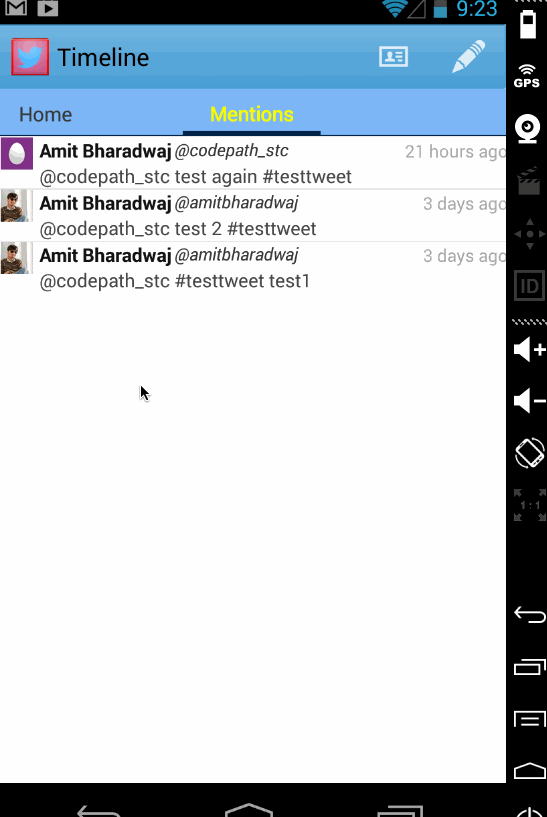
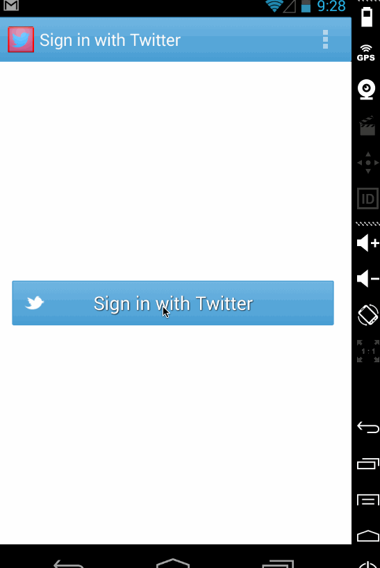

ImageSearch
===========

Assignment 4. 4th week

Walkthrough:

How many hours did it take to complete?
10.  

Which required and optional stories have you completed?
All mandatory ones. Just one optional: I am showing progress bar on api calls.
I did spend some time on styling and error checking. Tried to remove code duplication.

How many hours did it take to complete?
10 . Couldn't spend lot of this week. 

Which required and optional stories have you completed?
- [x] User can sign in to Twitter using OAuth login
- [x] User can view the tweets from their home timeline
- [x] User should be able to see the username, name, body and timestamp for each tweet
- [x] User should be displayed the relative timestamp for a tweet "8m", "7h"
- [x] User can view more tweets as they scroll with infinite pagination
- [x] Optional: Links in tweets are clickable and will launch the web browser (see autolink)
- [x] User can compose a new tweet
- [x] User can click a “Compose” icon in the Action Bar on the top right
- [x] User can then enter a new tweet and post this to twitter
- [x] User is taken back to home timeline with new tweet visible in timeline
- [x] Optional: User can see a counter with total number of characters left for tweet
* The following advanced user stories are optional:

- [x] Advanced: User can refresh tweets timeline by pulling down to refresh (i.e pull-to-refresh)
- [ ] Advanced: User can open the twitter app offline and see last loaded tweets
- [ ] Tweets are persisted into sqlite and can be displayed from the local DB
- [ ] Advanced: User can tap a tweet to display a "detailed" view of that tweet
- [ ] Advanced: User can select "reply" from detail view to respond to a tweet
- [ ] Advanced: Improve the user interface and theme the app to feel "twitter branded"
- [ ] Bonus: User can see embedded image media within the tweet detail view
- [x] Bonus: Compose activity is replaced with a modal overlay

GIF walkthrough of all required and optional stories (using LiceCap)

